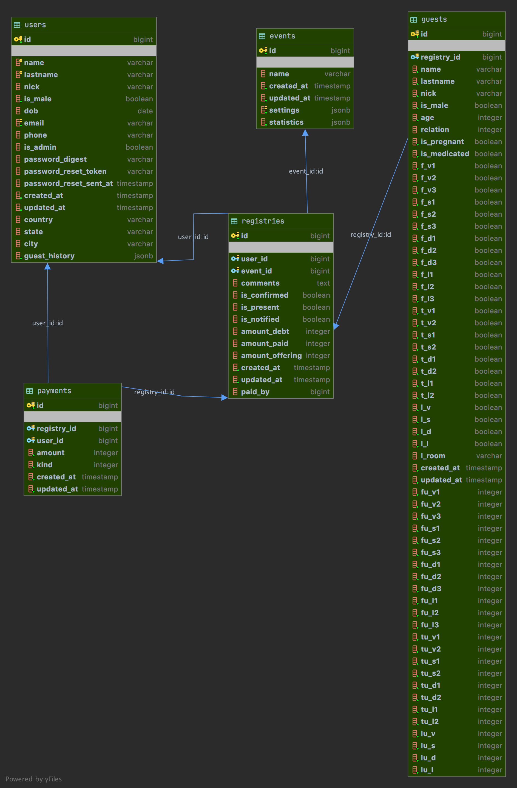

## DataBase Diagram



## Queries

There are a list of common used [queries](queries.md).

### Run DB Commands

All scripts use the following variables:

```bash
db_container=regdb
db=reg
pwd=123456
```

#### Configure JetBrains DataGrip

##### Heroku

```bash
heroku pg:credentials:url
```

Copy the results, and in advanced tab set the following:

- `ssl` => `true`
- `sslfactory` => `org.postgresql.ssl.NonValidatingFactory`

Reset heroku db

```bash
heroku pg:reset --confirm <app_name>
```

Interactive console
(add `-c 'SELECT * FROM users'` to run queries from command line)

```bash
docker run -it --rm -e PGPASSWORD=$pwd \
           --link $db_container:postgres postgres:12.3 \
           psql -h $db_container -d $db
```

---

## DataBase Backups 📦

### Create ⬇️

#### Heroku 🌎

```bash
appname={{HEROKU_APPNAME}}
dump_file="$(date +%y%m%d-%H%M)-db.dump"

heroku pg:backups capture -a $appname
url=$(heroku pg:backups public-url -a $appname)
curl -o "$dump_file" "$url"
```

#### Local 🏠

```bash
docker run -it --rm -v $PWD:/tmp/data -e PGPASSWORD="$pwd" \
           --link $db_container:postgres postgres:12.3 \
           pg_dump -h $db_container -U postgres -d "$db" \
           -Fc --no-acl --no-owner -f "/tmp/data/db.dump"
```

### Restore ⬆️

#### Heroku 🌎

```bash
heroku pg:backups
heroku pg:backups:restore b001 --confirm app_name
```

#### Local 🏠

```bash
docker run -it --rm -v $PWD:/tmp/data:ro -e PGPASSWORD="$pwd" \
           --link $db_container:postgres postgres:12.3 \
           pg_restore --verbose --clean --no-acl --no-owner --no-password \
           -h $db_container -U postgres -d "$db" /tmp/data/db.dump
```
